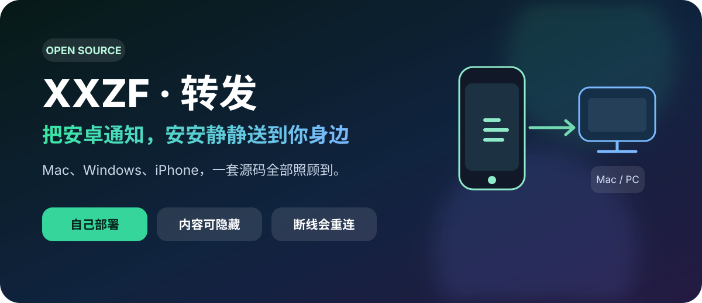
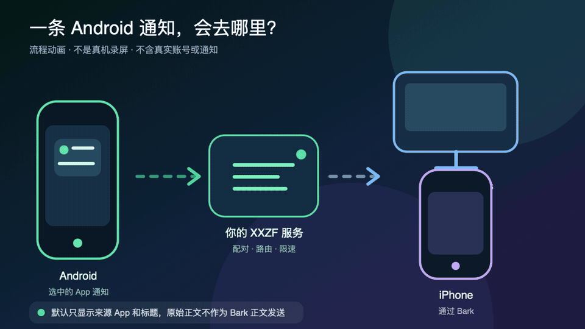
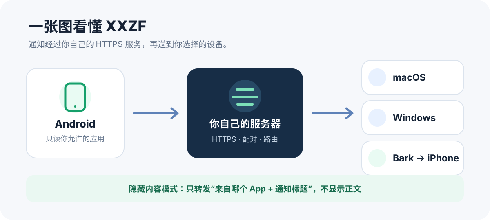
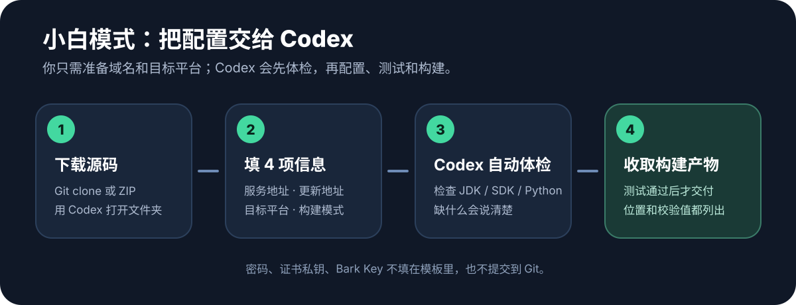

# XXZF / 转发

<p align="center">
  
</p>

<p align="center">
  <a href="README.en.md">English</a> ·
  <a href="CODEX.md">Codex 小白构建</a> ·
  <a href="docs/部署指南.md">部署指南</a> ·
  <a href="docs/配置参考.md">配置参考</a> ·
  <a href="SECURITY.md">安全策略</a> ·
  <a href="SUPPORT.md">获取帮助</a>
</p>

<p align="center">
  <a href="https://github.com/Apex-Studio-He/xxzf-git/actions/workflows/ci.yml"></a>
  · <a href="https://github.com/Apex-Studio-He/xxzf-git/releases">版本发布</a>
  · <a href="LICENSE">MIT License</a>
</p>

## 先说人话：它是干嘛的？

你有一台 Android 手机，但平时更常盯着 Mac、Windows 电脑或 iPhone？

XXZF 可以把 Android 上的通知送到这些设备。比如快递、外卖、短信、设备告警，不用一会儿看这台、一会儿看那台。

它不是公共“中转站”，而是一套可自己部署的完整源码：服务地址由你填，设备由你配对，转发哪些 App 也由你选。

> **30 秒判断适不适合你：** 有自己的服务器、NAS 或长期在线的 Mac，并愿意配置域名和 HTTPS，就可以继续；如果只想下载一个 App 直接使用，这个源码项目目前并不适合。

<p align="center">
  
</p>

<p align="center"><sub>流程动画，不是真机录像；画面不含真实账号、设备或通知。</sub></p>

### 你会得到什么

- **Android 发送端**：选择要转发的 App，后台监听通知，管理已连接设备。
- **macOS 接收端**：六位码配对、系统通知、断线重连、更新校验。
- **Windows 接收端**：配对、后台接收、系统通知和安全更新。
- **iPhone / Bark**：不用自签 iOS App，用 App Store 中的 Bark 接收；通知可显示 `安卓-应用名` 与 Android App 图标。
- **Python 服务端**：配对、设备密钥、通知路由、限速、诊断和 Bark 绑定。
- **Bark 绑定网页**：完整 HTML / CSS / JavaScript 源码，跟服务端一起放到你的域名下。
- **部署与更新工具**：Nginx、systemd、launchd 模板，三端签名更新清单和校验工具。

<p align="center">
  
</p>

## 适合什么人？

如果你符合下面任意一条，就很适合：

- 日常同时用 Android 和 iPhone，不想漏掉 Android 通知。
- 工作时一直看电脑，希望手机通知直接出现在桌面。
- 有 NAS、云服务器或 Mac mini，喜欢把数据放在自己控制的环境。
- 想学一个真正横跨 Android、macOS、Windows 和 Web 的开源项目。

如果你不想准备域名、HTTPS 和一台能长期运行的服务器，那么这套自建方案可能不适合你。

## 小白该从哪里开始？

不需要先把整本文档背下来。照着下面选一条路就行。

### A. 我想让 Codex 帮我构建（推荐小白）

<p align="center">
  
</p>

1. 下载或 clone 这个项目，用 Codex 打开项目文件夹。
2. 把 `codex/request.example.json` 复制为 `codex/request.local.json`。
3. 填入你的公开 HTTPS 地址、目标平台和 `debug` / `release`。
4. 对 Codex 说：

   ```text
   请按 CODEX.md 读取 codex/request.local.json，先体检，再在隔离副本中配置、测试并构建 XXZF。
   ```

Codex 会先告诉你缺少什么环境，不会在没说明时突然下载一大堆东西。自定义域名只写入临时构建副本，公开源码保持干净。

详细到每一步的说明在 [Codex 小白构建指南](CODEX.md)。

### B. 我想自己手动部署

你需要：

- 一台 macOS 或 Linux 服务器（NAS、云服务器或 Mac mini 都可以）。
- 一个你能管理 DNS 的域名。
- 一张浏览器信任的 HTTPS 证书。
- 构建客户端的电脑：Android 和 macOS 用 Mac，Windows 用 Windows。

然后按 [小白部署指南](docs/部署指南.md) 从第 1 步做到第 11 步。每一步都附有检查命令，不用靠猜。

## 只想转发到 iPhone？

这条路最省事：iPhone 不需 Xcode、不需开发者模式，也不需每 7 天重签。

1. iPhone 从 App Store 安装 Bark，允许通知。
2. Android 端打开“连接 iPhone（Bark）”，生成一次性二维码或六位码。
3. 用 iPhone 打开你自建的 Bark 绑定页（例如 `https://notify.example.com/xxzf/bark/`）。
4. 从 Bark 首页复制完整测试地址，粘贴到绑定页，再输入六位码。
5. 回到 Android 的“管理 iPhone”，可以单独测试、查看状态或删除某一台。

默认使用 `https://api.day.app`。也可以在 `XXZF_BARK_ALLOWED_BASES` 中精确加入自己的 Bark HTTPS base（支持安全路径前缀），然后在 Bark App 中添加同一个服务器。服务端只保存发送所需的 Bark base 和 device key，且使用独立、权限受限的私密存储文件。

## 通知会显示什么？

默认的产品思路是“知道有事，但不在大屏上暴露细节”：

```text
标题：安卓-微信
正文：（不转发原始内容）
```

Android 只监听你在白名单中打开的 App。不想转发某个 App，关掉它的开关即可。

## 项目里到底有哪些东西？

| 目录 | 你能找到的内容 |
|---|---|
| `android/` | Android Manifest、Java 业务源码、页面资源、ZXing 依赖、测试和 APK 构建脚本 |
| `server/` | Python 服务、设备/审计/诊断/Bark 存储、macOS 客户端源码与测试 |
| `windows/` | Windows C# 客户端、更新器、图标、安装/签名/验证脚本 |
| `public/bark/` | Bark 绑定网页的 HTML、CSS 和 JavaScript 完整源码 |
| `nginx/` | 公网只开放必要路由、其余默认拒绝的 Nginx 规则 |
| `deploy/` | Linux systemd、macOS launchd、Nginx 可复制部署模板 |
| `scripts/` | Codex 体检/隔离构建、安装环境、更新发布、签名和隐私扫描 |
| `codex/` | Codex 构建填写卡，只允许公开配置 |

不会把 APK、DMG、EXE 当作“神秘现成包”塞进源码。开源仓库提供的是可审查、可测试、可重新构建的完整源码；你的成品会由构建脚本在 `dist/` 中生成。

## 环境一览

| 部分 | 最低环境 |
|---|---|
| 服务端 | macOS 12+ 或常见 64 位 Linux；Python 3.9+；Nginx；域名；TLS 证书 |
| Android 构建 | macOS；JDK 17；Android SDK Platform 35；Build Tools 35.0.0 |
| Android 运行 | Android 8.0 / API 26+；用户授予通知读取与后台运行权限 |
| macOS 构建 | macOS 12+；Xcode Command Line Tools；正式发布需 Developer ID |
| macOS 运行 | macOS 10.14+ |
| Windows 构建 | Windows 10/11；PowerShell 5.1+；.NET Framework 4.8 Developer Pack；IExpress |
| iPhone | 安装 Bark 并允许通知；不需 Xcode 或开发者模式 |

Python 服务运行时只使用标准库和仓库内的 Segno；Android 二维码解析使用仓库内的 ZXing Core。它们的来源和许可证在 [THIRD_PARTY_NOTICES.md](THIRD_PARTY_NOTICES.md) 中说明。

## 开发者快速测试

```bash
# Codex 工作流填写卡和体检单元测试
python3 scripts/test_codex_workflow.py

# Python 服务端
PYTHONDONTWRITEBYTECODE=1 python3 -m unittest discover -s server -p 'test_*.py'

# Android
./android/test_receiver.sh
./android/test_security.sh
./android/build.sh

# macOS
./server/mac_notifier/build.sh
./server/mac_receiver/test_update_manager.sh
./server/mac_receiver/build.sh
./server/mac_receiver/test_update_install.sh

# 公开前隐私/秘密扫描
./scripts/privacy_scan.sh
```

Windows 在 Windows PowerShell 中运行：

```powershell
.\windows\build.ps1
.\windows\build-installer.ps1
```

## 数据和安全怎么处理？

- 客户端只信任构建时写入的 HTTPS 服务地址，不会自动改连其他服务器。
- 每台设备使用独立凭据；删除某台设备时，不影响其他设备。
- Bark Key、数据库、诊断、通知归档和签名材料放在源码目录外，建议权限为 `0700/0600`。
- 自动更新同时校验签名、固定域名、文件名、文件大小和 SHA-256。
- 管理页与审计页不配置公网路由，通过本机或 SSH 隧道访问。
- 没有广告、分析 SDK、设备指纹、主密钥账户或远程控制入口。

示例配置使用不可用的文档域名，第一次构建时必须换成你控制的 HTTPS 地址。这样即使新手忘记配置，客户端也不会把通知发往一台陌生服务器。

更完整的威胁边界和漏洞报告方式见 [安全策略](SECURITY.md)。

## 准备给别人使用前

- 用你自己的 HTTPS 域名构建客户端，并做一次 Android → 服务端 → 目标设备的真机测试。
- Android 使用独立的长期 release keystore，macOS 使用 Developer ID 签名并公证，Windows 使用 Authenticode 签名。
- 生成自己的 RSA 更新密钥，将公钥写入客户端，私钥只留在发布机。
- 从干净 checkout 重新构建，运行 `./scripts/privacy_scan.sh` 和 Gitleaks，确认没有本地配置或签名材料混进成品。

所有发布签名变量、更新服务和验收命令都在 [配置参考](docs/配置参考.md) 中。

## 文档导航

- [Codex 小白构建指南](CODEX.md)：不会搭环境，从这里开始。
- [小白部署指南](docs/部署指南.md)：把服务端、HTTPS、Bark 页和客户端连成一套。
- [配置参考](docs/配置参考.md)：环境变量、签名材料、更新发布和真机验收。
- [完整源码清单](docs/源码清单.md)：每个功能的源码在哪里、用什么测试验证。
- [宣传素材包](docs/宣传素材包.md)：真机演示分镜、平台文案和可直接使用的宣传图。
- [安全策略](SECURITY.md)：数据边界、部署责任和漏洞报告。
- [获取帮助](SUPPORT.md)：该去 Discussions、Issues 还是私密安全报告。
- [贡献指南](CONTRIBUTING.md)：提交修复或新功能前的检查项。
- [更新记录](CHANGELOG.md)：公开源码版本的变化与发布边界。

## 许可证

XXZF 代码采用 [MIT License](LICENSE)。内置第三方组件保留各自的许可证，见 [THIRD_PARTY_NOTICES.md](THIRD_PARTY_NOTICES.md)。
